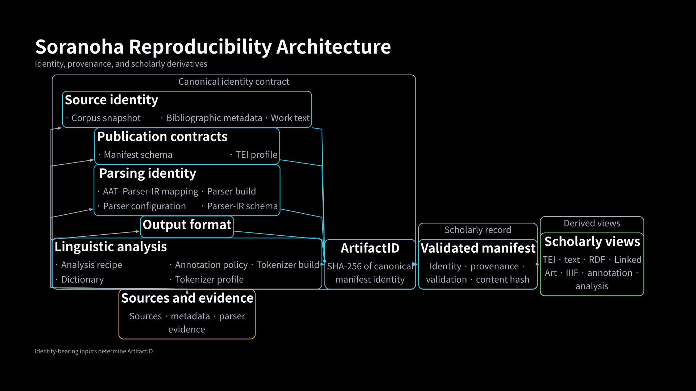
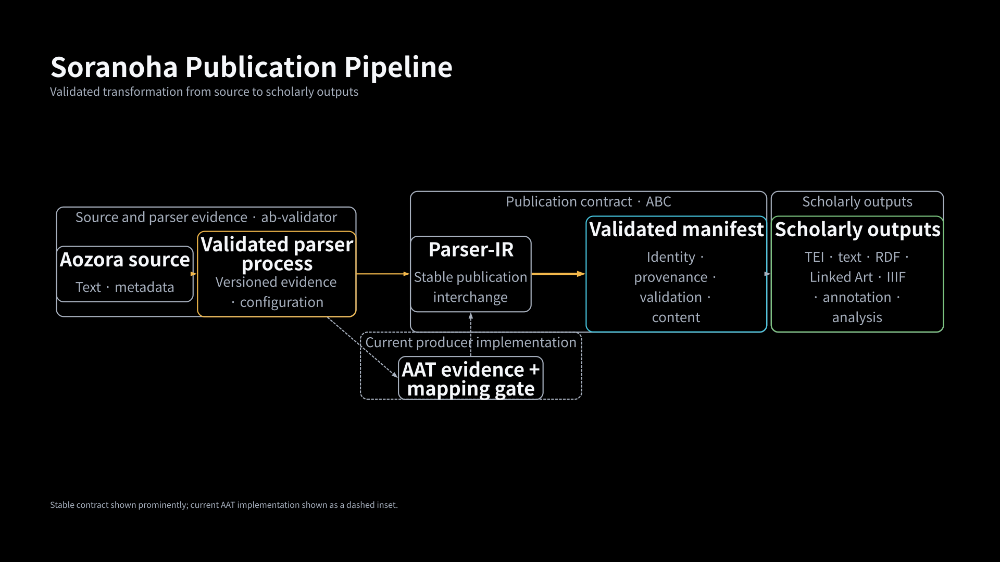

<!--
Citation provenance:
- abstract-refs.bib sha256:ecac6b1d04171239d5cd1467a37802ff8e9fe8a5820f03ebbdb05cec196ae897
- digital_humanities_abstracts.csl sha256:51537ae9dd3a3a77a971757942c3769c722379aa78d7f2a0bec442e57197c1c9
Budget: 22 min talk + 5 min demo + 3 min buffer.
Render with the downstream website generator; the Markdown remains Pandoc-flavored and backend-neutral.
-->

# Aozora Bunko Is Shared Research Infrastructure

- Public reading and literary scholarship
- Corpus linguistics, stylistics, and NLP
- Conversational and retrieval-based exploration
- One source collection, many research environments [@aozorabunko2026; @iwata2025]

**Infrastructure question:** can a researcher identify exactly what each derived corpus contains and how it was produced?

<!-- 1:00. Evidence: archived abstract, paragraph 1. -->

# One Source, Many Derived Corpora

```text
Aozora source
  ├─ reading platforms
  ├─ parser libraries
  ├─ TEI editions
  ├─ plaintext corpora
  ├─ tokenized datasets
  └─ LLM / retrieval-augmented generation indexes
```

The transformation can be treated as disposable preprocessing.

**Our system, Soranoha, treats it as a versioned scholarly process.**

# Parallel Work — TEI-EAJ aozora_tei

- Curated human encoding of Aozora works in TEI P5
- Encoding depth organized through Levels 2–5
- Shared workflow for headers, drafts, completed files, and enrichment
- Tools and visualizations that make the encoding usable without reading raw XML

[Project repository](https://github.com/TEI-EAJ/aozora_tei) ·
[Project wiki](https://github.com/TEI-EAJ/aozora_tei/wiki)
[@teieaj2023; @okada2023]

**Parallel emphasis:** TEI-EAJ develops curated scholarly encodings; Soranoha measures and versions corpus-scale transformations.

<!--
Evidence path: abc/flake.nix; pinned input tei-eaj-aozora-tei.
Inspect/regenerate: nix run .#abc-tei-eaj-aozora-tei-source
Inputs: TEI-EAJ/aozora_tei@77a675fc2771936f9544505d922d4cd45075338c
Expected: store path containing README.md and data/complete/tei_lib_lv4/1567_tei.xml
Class: pinned upstream comparison source
-->

# Research Questions

1. What markup syntax does the authoritative source corpus contain?
2. What does each parser preserve, normalize, or lose?
3. How do publication and tokenizer choices change downstream research views?

**Contribution:** evidence that connects source syntax to versioned outputs.

# Terms Used in This Talk

| Term | Meaning here |
| --- | --- |
| Source authority | Official documentation and the source works themselves |
| Conformance | Recognition of documented test cases |
| Coverage | Share of real-corpus markup occurrences represented |
| Fidelity | Representation quality on works a parser completes |
| Robustness | Whether it completes the works, weighted by what is missed |
| AAT | **Aozora Adapter Tree**: a record of what each parser produced |
| Parser-IR | **Parser Intermediate Representation**: where publication decisions are recorded |
| Manifest | Versioned identity and provenance for a derived artifact |

# Readable Does Not Mean Plain

```text
吾輩《わがはい》
※［＃「口＋世」、U+546D］
青空［＃「青空」に傍点］
［＃ここから2字下げ］
```

- Ruby and gaiji
- Emphasis and headings
- Layout, notes, images, warigaki, and kunten
- Conventions whose meaning depends on documented syntax and context

# What Counts as Evidence?

## Source authority

- Official Aozora documentation
- The versioned source works themselves

## Supporting evidence

- Community notation specifications
- Parser outputs and adapter measurements
- TEI-EAJ comparison works [@teieaj2023]

**A parser cannot define away syntax that exists in the source.**

<!-- Evidence: parser study authority caveat and repository design boundaries. -->

# Building the Source-Authority Inventory

1. Extract markers directly from the pinned corpus snapshot.
2. Reconcile observed forms with official documentation.
3. Group 50 inventory rows into 10 presentation families.
4. Assign reviewed representation and TEI P5 projection targets.
5. Gate unknown or unrepresentable syntax.

<!-- Evidence: ab-validator/docs/superpowers/reports/2026-07-04-source-authority-representability.md -->

# What Is in the Corpus?

## 2026-04-25 source snapshot

- **17,894 works**
- **4.3 million** de-duplicated markup occurrences
- **50** source-inventory rows
- **10** presentation families
- **3,607,926 ruby annotations** dominate the corpus

Per-family counts overlap; rows do not sum to the de-duplicated total.

Ruby is about **83% of the full inventory**; the parser-coverage denominator below is a selected construct set, where ruby is about **89%**.

## Rare Syntax Still Matters

| Construct | Works |
| --- | ---: |
| Multicolumn layout | 26 |
| Tables | 7 |
| Quote blocks | 6 |

- Frequency tells us impact, not semantic importance.
- Rare constructs test whether a pipeline preserves the source's expressive range.
- Long-tail syntax needs explicit evidence, not silent fallback.

<!--
Evidence path: ab-validator/docs/superpowers/reports/2026-07-04-source-authority-representability.summary.json
Inspect/regenerate: jq '{works_scanned,markers_total,row_count:(.rows|length),selected:(.rows|with_entries(select(.key=="ruby.basic" or .key=="layout.multicolumn" or .key=="structure.table" or .key=="structure.quote_block")))}' ab-validator/docs/superpowers/reports/2026-07-04-source-authority-representability.summary.json
Inputs: source-authority extraction over the 17,894-work snapshot
Expected: markers_total 4323915; 50 rows; ruby 3607926 occurrences; multicolumn 26 works; tables 7; quote blocks 6
Class: checked-in generated source-authority summary
-->

# What Makes a Corpus Version Reproducible?

{width=100%}

<!--
Evidence path: abc/docs/architecture-presentation.edn; abc/docs/figures/soranoha-reproducibility-architecture.svg
Inspect/regenerate: nix run .#abc-presentation-diagrams; nix build .#checks.x86_64-linux.abc-presentation-diagram-drift --no-link
Inputs: checked-in presentation model; architecture stages and ADR registry; pinned Graphviz and Noto CJK font environment
Expected: byte-identical 1920x1080 SVG; sources and computational evidence enter the identity contract before validated manifests and scholarly views
Class: generated, checked-in, drift-validated presentation figure

ArtifactID is not a materialized-file byte hash.
-->

# Five Parsers, Three Questions

- `aozora-pipeline`: multi-crate Rust parser (`P4suta/aozora`); our reference
- `aozora2html`: the aozorahack HTML converter [@aozorahack2026]
- `aozora2`: Rust format converter [@takahashi2026]
- `aozora-rs`: Rust parser [@kinokov2026]
- `AozoraEpub3`: Java/EPUB converter [@aozoraepub32026]

No parser is assumed correct because of its name or output format.

<!--
Crosswalk: aozora-pipeline = aozora / ab-aozora; aozora2 = aozora-core;
aozora-rs = aozora-rs-core when measured natively; AozoraEpub3 = aozora-epub3.
aozora-pipeline is P4suta/aozora, a measured candidate—not completed Soranoha consolidation.
-->

| Measurement | Question |
| --- | --- |
| Conformance breadth | Which documented test cases are recognized? |
| Frequency-weighted coverage | What share of real-corpus markup occurrences is represented? |
| Fidelity / robustness | Given completion, how faithful is output—and does the parser complete? |

**Speed is a fourth engineering constraint, not a correctness score.**

# Conformance Breadth

The pinned [P4suta `aozora` conformance suite](https://github.com/P4suta/aozora)
provides **127 canonical source-and-expected-output cases** in 24 syntax families.
It is a comparison instrument, not source authority.

`［＃「青空」に傍点］`　 `［＃ここから表］`　 `［＃改ページ］`

| Syntax family | Cases | `aozora2` | `aozora2html` | `aozora-rs` | `AozoraEpub3` |
| --- | ---: | ---: | ---: | ---: | ---: |
| Emphasis and 傍線 | 40 | 10 | **29** | 3 | 0 |
| Annotation | 7 | **7** | 0 | 0 | 0 |
| Containers | 15 | **8** | 3 | 2 | 0 |
| Gaiji | 7 | **6** | 5 | **6** | 0 |
| Ruby | 3 | **3** | **3** | **3** | 0 |

`aozora-pipeline` passes **22 of 25 required cases**. Across the four comparison
adapters in the table, no case passes in eight families — break, structural
marker, 縦中横, 割注, composite, table/column, angle quote, and 返り点.

**A conformance ranking is not a capability ranking.**

<!--
Evidence path: ab-validator/docs/superpowers/reports/2026-07-08-aozora-parser-comparison-study.md
Inspect/regenerate: sed -n '85,175p' ab-validator/docs/superpowers/reports/2026-07-08-aozora-parser-comparison-study.md
Inputs: 127 P4suta vectors; independent official-doc seed
Expected: 24 families; 25 must vectors; aozora-pipeline 22/25; per-family pass counts shown in the table
Class: checked-in comparison report; supporting evidence, not source authority
-->

# Frequency-Weighted Corpus Coverage

| Parser | Coverage |
| --- | ---: |
| `aozora-pipeline` | **0.969** |
| `aozora-rs` | 0.938 |
| `AozoraEpub3` | 0.926 |
| `aozora2` | 0.855 |
| `aozora2html` | 0.743 |

Ruby is about 89% of the selected **coverage-weighted occurrences**: read the total as **ruby coverage adjusted by the long tail**.

<!--
Evidence path: ab-validator/docs/superpowers/reports/2026-07-08-aozora-parser-comparison-study.md
Inspect/regenerate: sed -n '219,345p' ab-validator/docs/superpowers/reports/2026-07-08-aozora-parser-comparison-study.md
Inputs: checked-in July 2026 parser study; pinned-denominator reconciliation report
Expected: coverage 0.969/0.938/0.926/0.855/0.743; robustness interpretation over 17,886 works
Class: checked-in report
-->

# Fidelity and Robustness Are Different

| Evidence | Result |
| --- | --- |
| Highest completed-work fidelity | `aozora2html` **0.974** |
| Hidden robustness loss | **302** ruby-heavy failures; **24.7%** of ruby occurrences |
| Complete over 17,886 works | `aozora-pipeline`, `aozora-rs` |

In [**ア、秋**](https://www.aozora.gr.jp/cards/000035/card236.html), `aozora2`
matches the one-paragraph reference. `aozora2html` produces **29 paragraph
fragments**, treating line breaks as paragraph boundaries.

**Per-work quality cannot compensate for systematically missing difficult works.**

<!--
Evidence path: ab-validator/docs/superpowers/reports/2026-07-08-fidelity-robustness-split.md
Inspect/regenerate: sed -n '140,175p' ab-validator/docs/superpowers/reports/2026-07-08-fidelity-robustness-split.md
Inputs: common completed-work intersection; pinned 17,886-work robustness denominator
Expected: aozora2html fidelity 0.974; 302 ruby-heavy failures; 24.7% ruby mass missed; work-count completion 0.983
Class: checked-in report
-->

# What the Parser Comparison Supports

| Question | Result |
| --- | --- |
| Most real-corpus markup represented | `aozora-pipeline` |
| Highest fidelity when parsing succeeds | `aozora2html` |
| Fastest measured parser | `aozora-rs` |
| Broadest future base | `aozora-pipeline` |

The syntax table shows why consolidation still matters — parser strengths are
complementary rather than nested.

**This is a multi-criterion recommendation—not one overall scholarly score.**

<!-- Consolidation is not complete. The recommended candidate still drops jizume and yokogumi. -->

# From Authoritative Source to Scholarly Views

{width=100%}

<!--
Evidence path: abc/docs/architecture-presentation.edn; abc/docs/figures/soranoha-publication-pipeline.svg
Inspect/regenerate: nix run .#abc-presentation-diagrams; nix build .#checks.x86_64-linux.abc-presentation-diagram-drift --no-link
Inputs: checked-in presentation model; publication schemas and role registry; pinned Graphviz and Noto CJK font environment
Expected: byte-identical 1920x1080 SVG; source passes through validated parsing and Parser-IR into manifests and plural scholarly outputs
Class: generated, checked-in, drift-validated presentation figure

AAT is current producer detail rather than the stable publication contract.
-->

# Two Representation Boundaries

## AAT — what the parser produced

- Records raw markup, structured output, and which parser produced it
- Keeps parser-specific detail before publication policy is applied
- Gives five different parsers a comparable evidence format

## Parser-IR — where publication decisions are made

- Normalizes concepts once for all downstream outputs
- Records every ambiguity, addition, unsupported feature, and structural loss
- Feeds TEI, visible plaintext, preservation records, and analytical data

# A Worked Mapping for 傍点

| Stage | Representation | Decision |
| --- | --- | --- |
| Source | `青空［＃「青空」に傍点］` | authoritative marker |
| AAT | `style_type: boten` | preserve descriptive identity |
| Parser-IR | `emphasis` | normalize under rule `A-06` |
| TEI | `<hi>` plus preservation evidence | publish while retaining recoverability |

**Normalization does not have to mean silent loss.**

<!--
Evidence path: ab-validator/data/aat-to-parser-ir-mapping-v1.json
Inspect/regenerate: jq '.transform_rule_descriptions[] | select(.rule_id == "A-06"), .loss_taxonomy.AMBIGUITY' ab-validator/data/aat-to-parser-ir-mapping-v1.json
Inputs: mapping version 0.2.1
Expected: A-06 style -> emphasis; 130 observed style mappings; AMBIGUITY records_sidecar true
Class: checked-in generated mapping contract
-->

## Transformation Records Make Decisions Inspectable

| Category | Meaning |
| --- | --- |
| `LOSS` | AAT information has no Parser-IR field |
| `INVENTION` | Parser-IR requires a value AAT does not supply |
| `AMBIGUITY` | Related concepts differ in semantics or range |
| `UNSUPPORTED` | No Parser-IR representation exists |
| `STRUCTURAL` | Tree shape forces boundary or span loss |

Each category has an explicit action and says whether detail moves to a separate preservation file.

<!-- Evidence: ab-validator/data/aat-to-parser-ir-mapping-v1.json loss_taxonomy. -->

# Actual TEI XML from TEI-EAJ

## [走れメロス](https://www.aozora.gr.jp/cards/000035/card1567.html) — Level 4

```xml
<p>
  <persName corresp="#メロス">メロス</persName>は激怒した。
  必ず、かの<persName corresp="#ディオニス">
    <ruby>
      <rb>邪智暴虐</rb>
      <rt>じゃちぼうぎゃく</rt>
    </ruby> の王
  </persName>を除かなければならぬと決意した。
  <persName corresp="#メロス">メロス</persName>には政治がわからぬ。
  <persName corresp="#メロス">メロス</persName>は、
  <roleName>村の牧人</roleName>である。
</p>
```

[Pinned TEI-EAJ project source](https://github.com/TEI-EAJ/aozora_tei) [@teieaj2023; @okada2023]

<!--
Evidence path: pinned input data/complete/tei_lib_lv4/1567_tei.xml
Inspect/regenerate: tei_root="$(nix run .#abc-tei-eaj-aozora-tei-source)"; sed -n '57,67p' "$tei_root/data/complete/tei_lib_lv4/1567_tei.xml"
Inputs: TEI-EAJ/aozora_tei@77a675fc2771936f9544505d922d4cd45075338c
Expected: SHA-256 c2f6e43fbc3235e832feccf47e5b06c896959d8aa2a9798132e8dca12df5c7be; work 1567; curated Level 4
Class: pinned upstream curated TEI

DRAFT XML GATE
Evidence path: target abc/paper/demo-melos-real/{parser-ir.aozora2html.json,metadata-record.json,source.manifest.json,tei.xml,tei.manifest.json,tei-validation-result.json}
Inspect/regenerate: rg --files abc | rg 'demo-melos-real/(parser-ir|metadata-record|source\.manifest|tei\.xml|tei\.manifest|tei-validation-result)'
Inputs: work ID 1567; tracked Parser-IR, metadata/persons, source manifest; generated-at 2026-07-04T00:00:00Z
Expected: work-matched TEI plus manifest identity and zero validation findings
Class: readiness gate; no Soranoha fixture is shown as a real edition
-->

# Publication Is Plural

- **TEI** provides structured scholarly transcription and validation [@okada2023].
- **Visible plaintext** contains body text only.
- **Preservation files** retain source apparatus, provenance, and policy-specific detail.
- **Tokenized artifacts** are identified analytical views.
- **The manifest** records which versioned inputs and rules produced each artifact.

Parser-IR is a publication boundary, not a claim that every output should contain the same information.

<!-- Evidence: parser-ir-publication-policy-v0.json and publication-bundle reports. ArtifactID is not content hash. -->

# Tokenization Is a Scholarly Choice

- Segmentation changes the units available for counting and comparison.
- Lemmas and parts of speech depend on tokenizer and dictionary identity.
- Literary and historical forms expose differences hidden by contemporary prose.
- Soranoha publishes tokenizer-specific artifacts as parallel analytical views [@kanda2025; @worksapplications2026].

**There is no single authoritative tokenized corpus.**

# Two Regions, Different Analyses

| Region | Sudachi A/B | Sudachi C | Vibrato + UniDic CWJ |
| --- | --- | --- | --- |
| 求むる | 求むる（動詞） | 求むる（動詞） | 求｜む｜る（名詞／名詞／助動詞） |
| 竹馬の友 | 竹馬｜の｜友 | 竹馬の友（固有名詞） | 竹馬｜の｜友 |

Dictionary choice can change POS even when token boundaries look similar [@den2008; @daactools2026].

<!--
Evidence path: pinned Sudachi and Vibrato/UniDic flake outputs; ab-validator/docs/superpowers/reports/2026-04-29-morph-full-corpus.md
Inspect/regenerate: printf 'その地点を求むるならば\nメロスには竹馬の友があった。\n' | nix run .#ab-validator-sudachi -- --mode A; printf 'その地点を求むるならば\nメロスには竹馬の友があった。\n' | nix run .#ab-validator-vibrato-tokenize -- --sysdic "$(nix build .#ab-validator-vibrato-dict-cwj --no-link --print-out-paths)/share/vibrato/unidic-cwj-202512.dic.zst"
Inputs: sudachi-20260116; unidic-cwj-202512; literal bounded regions
Expected: Sudachi A keeps 求むる and splits 竹馬/の/友; Vibrato splits 求/む/る and 竹馬/の/友
Class: bounded live query over pinned analyzers
-->

# Detecting Old Orthography

The author hand-labeled three outcomes on an **LLM-assisted, stratified sample**
of 300 sentences — 197 `accept`, 22 `normalize`, and 81 `reject`.

| Detector | Recall | Precision | F1 |
| --- | ---: | ---: | ---: |
| Heuristic | 0.9087 | 0.9256 | 0.9171 |
| Character-only ML, 5-fold mean | 0.9468 | 0.9718 | 0.9586 |

`同時ニ僕モ、ココマデ来テハ後戻リハデキナイ。` → `accept`

The ML model recovers more short `normalize` cases, but neither score is a claim
about semantic interpretation beyond this labeled set.

<!--
Evidence path: ab-validator/reports/ortho-detect/2026-07-05-phase2.5-llm-eval-300.md; ab-validator/data/ortho-gold/sample-300-unlabeled.jsonl
Inspect/regenerate: sed -n '186,245p' ab-validator/reports/ortho-detect/2026-07-05-phase2.5-llm-eval-300.md; jq -r '.label' ab-validator/data/ortho-gold/sample-300-unlabeled.jsonl | sort | uniq -c; jq -c 'select(.work_id == "Tanizaki_J_Kagi" and .char_offset == 49666)' ab-validator/data/ortho-gold/sample-300-unlabeled.jsonl
Inputs: 300 corpus-stratified candidates; final author-assigned three-way labels; deterministic strided 5-fold evaluation
Expected: accept 197, normalize 22, reject 81; heuristic R/P/F1 0.9087/0.9256/0.9171; ML mean R/P/F1 0.9468/0.9718/0.9586
Class: checked-in human-label evaluation report and label file
-->

# Preserve the Source, Normalize the View

`ゐる → いる`　 `なほ → なお`　 `いふ → いう`　 `やう → よう`

**The transcription remains unchanged.** Sentence-level TEI records the
orthography evidence; an optional analytical view normalizes tokenizer input
and maps token spans back to source coordinates.

```xml
<s type="orthographic-katakana">吾輩ハ猫デアル。</s>
```

- TEI-EAJ Level 2 preserves the original orthography.
- Level 3 can carry sentence-level evidence.
- Levels 4–5 can add linguistic annotation and normalized analytical views.

Across 25 parallel old/new editions, reconstruction matched modern vocabulary
for **94.8% of 10,444 historical tokens**. The normalization policy hash is part
of the analytical artifact's identity.

<!--
Evidence path: ab-validator/reports/ortho-detect/2026-07-08-lane-b-coverage-probe.md; ab-validator/tests/parser-ir-ortho-publication-smoke.sh; abc/data/analysis-recipes/token-basic-ja-v1.json
Inspect/regenerate: sed -n '109,145p' ab-validator/reports/ortho-detect/2026-07-08-lane-b-coverage-probe.md; nix build .#checks.x86_64-linux.parser-ir-ortho-publication-smoke --no-link; jq '.normalization_policy' abc/data/analysis-recipes/token-basic-ja-v1.json
Inputs: 25 pinned parallel editions; 10,444 historical old tokens; parser-IR orthography smoke fixture; checked-in analysis recipe
Expected: 94.8% pron-reconstruction agreement; TEI contains s type="orthographic-katakana"; normalization policy is explicit and versioned
Class: checked-in evaluation report, executable smoke test, and policy data
-->

# Live Demo — Follow the Evidence

1. Inspect source constructs and authority-backed mappings.
2. Compare selected parsers.
3. Inspect AAT → Parser-IR transformation records.
4. Materialize TEI and visible plaintext.
5. Compare tokenization over one selected region.

<!--
DEMO BUDGET: 5:00; never run corpus-scale work live.

Preflight tracked demo artifacts:
  rg --files abc | rg 'demo-(rashomon|melos)-real/(parser-ir|divergence|tei|plain)'

Update this comment with actual tracked monorepo paths after the demo artifacts land.
Never use machine-local database paths or an untracked references/ directory.
Each live read-only jq/rg/display command must complete in under five seconds.

Fallback: narrate slides 19, 20, 21, and 23; do not improvise a corpus-scale run.
Provenance narrative: sibling archive paper/demo-trace.md; it is not a build input.
-->

# Current Limits and Next Work

- Long-tail gaps remain, including 字詰め and 横組 in the recommended candidate.
- Parser consolidation is recommended, not complete.
- A work-matched TEI-EAJ/Soranoha XML comparison is in progress.
- TEI Levels 4–5 require editorial and enrichment work.
- Tokenizer suitability needs work-level and genre-aware evaluation.
- Every corpus, parser, dictionary, or profile change requires remeasurement.

**Work in progress means preserving the boundary between measured results and planned work.**

# Versioned, Inspectable, Comparable, Reproducible

- Inventory source syntax before transforming it.
- Measure parsers against authority-backed evidence.
- Record normalization and loss at representation boundaries.
- Publish parser- and tokenizer-specific scholarly views.
- Bind every view to explicit identities, contracts, and recipes.

**Corpus transformation is part of the scholarly method.**

[Soranoha repository](https://github.com/borh/soranoha)

# Appendix — Corpus Syntax Highlights

| Family | Occurrences | Example |
| --- | ---: | --- |
| Ruby | 3,607,926 | `吾輩《わがはい》` |
| Emphasis | 157,494 | `［＃太字］` |
| Indentation | 266,540 | `［＃ここから2字下げ］` |
| Gaiji | 121,535 | `※［＃「口＋世」、U+546D］` |
| Headings | 94,111 | `［＃大見出し］` |
| Decorations | 208,333 | `［＃「語」に傍点］` |
| Kunten | 34,549 | `［＃レ］` |
| Layout | 24,442 | `［＃ページの左右中央］` |
| Annotations | 35,517 | `「text」の注記付き` |
| Warigaki | 6,607 | `［＃割り注］` |

<!--
Evidence path: ab-validator/docs/superpowers/reports/2026-07-04-source-authority-representability.summary.json
Inspect/regenerate: jq '{works_scanned,markers_total,row_count:(.rows|length),rows:.rows}' ab-validator/docs/superpowers/reports/2026-07-04-source-authority-representability.summary.json
Inputs: 17,894-work source-authority extraction
Expected: 4,323,915 de-duplicated markers and 50 rows; presentation-family totals overlap
Class: checked-in generated source-authority summary
-->

# Appendix — Complete Syntax Coverage Catalog

The checked-in TOML matrix enumerates **all 56 modeled syntax rows**. Each row
records source examples, authority references, corpus prevalence, parser
recognition, AAT fidelity, TEI/plaintext projections, and validation properties.

| Category | Syntax IDs |
| --- | --- |
| Block | `heading.basic`, `heading.dogyo`, `heading.inline_form`, `heading.mado` |
| Glyph | `accent.diacritic`, `accent.dotted_letter`, `gaiji.dakuten_katakana`, `gaiji.jis_code`, `gaiji.marker`, `gaiji.un_embed`, `gaiji.unicode_codepoint`, `glyph.variant_note`, `iteration.kunoji` |
| Inline annotation | `annotation.bouki`, `annotation.chuuki`, `decoration.bold_italic`, `decoration.boten`, `decoration.bousen`, `decoration.direction_override`, `decoration.font_size`, `decoration.keigakomi`, `decoration.typeface`, `emphasis.basic`, `gaiji_ruby.inline_base`, `kunten.kaeriten`, `kunten.okurigana`, `ruby.basic`, `ruby.double`, `ruby.nested_forbidden`, `ruby.placement_directional`, `warichu.basic`, `warigaki.parenthetical` |
| Layout | `indentation.basic`, `indentation.burasage`, `indentation.chitsuki`, `indentation.jisage_block`, `indentation.jisage_oneline`, `indentation.jizume`, `layout.center_page`, `layout.multicolumn`, `layout.tcy`, `layout.yokogumi` |
| Media | `caption.block`, `caption.inline`, `figure.image_caption`, `figure.image_inline` |
| Milestone | `break.line_explicit`, `break.page_line` |
| Reference | `editor_note.unmapped`, `reference.frontref` |
| Source annotation | `annotation.layout_note`, `source.note_label`, `source.page_reference`, `source.reviewed_residual_command` |
| Structure | `structure.quote_block`, `structure.table` |

The 24-family P4suta suite is a narrower conformance instrument over part of
this catalog. It does not define Soranoha's source syntax authority.

<!--
Evidence path: ab-validator/data/aozora-syntax-coverage.toml
Inspect/regenerate: rg -c '^\[\[syntax\]\]' ab-validator/data/aozora-syntax-coverage.toml; rg -n '^id =|^category =|^source_examples =|^reference_sources =|^status =' ab-validator/data/aozora-syntax-coverage.toml
Inputs: checked-in syntax coverage matrix; authority references and evidence paths recorded per row
Expected: 56 syntax rows across 9 categories; each row has source, parser, adapter, projection, validation, prevalence, and representability fields
Class: checked-in evidence matrix backed by official documentation and corpus observation
-->

# Appendix — More Aozora Syntax Examples

| Function | Source example | Corpus evidence |
| --- | --- | ---: |
| Directional ruby | `｜あのひと《...》` | 318 occurrences |
| 縦中横 | `「12」の縦中横` | 19,794 occurrences |
| 罫囲み | `［＃ここから罫囲み］` | 717 occurrences |
| Quote block | `［＃ここから引用］` | 21 occurrences |
| Warigaki | `［＃割り注］` | 6,605 occurrences |

<!--
Evidence path: ab-validator/docs/superpowers/reports/2026-07-04-source-authority-representability.md
Inspect/regenerate: sed -n '70,100p' ab-validator/docs/superpowers/reports/2026-07-04-source-authority-representability.md
Inputs: 17,894-work source-authority extraction
Expected: directional ruby 318; tcy 19794; keigakomi 717; quote 21; warichu 6605
Class: checked-in generated source-authority report
-->

# Appendix — Parser Names and Measurement Lenses

- **Breadth** uses documented test cases, each weighted equally.
- **Coverage weight** uses real-corpus occurrences and is dominated by ruby.
- **Fidelity** measures representation quality on works completed by every parser.
- **Robustness** measures completion over the pinned corpus.
- **Speed** measures operational feasibility.

No single column answers every research question.

<!--
Evidence path: ab-validator/docs/superpowers/reports/2026-07-08-aozora-parser-comparison-study.md
Inspect/regenerate: sed -n '85,145p' ab-validator/docs/superpowers/reports/2026-07-08-aozora-parser-comparison-study.md
Inputs: adapter and native-parser measurement paths
Expected: separate conformance, capability, mass, fidelity, robustness, and speed interpretations
Class: checked-in comparison methodology
-->

# Appendix — Parser Coverage by Construct

| Construct | Source occurrences | aozora-pipeline | aozora-rs | aozora2 | aozora2html | AozoraEpub3 |
| --- | ---: | ---: | ---: | ---: | ---: | ---: |
| Ruby | 3,607,926 | 0.99 | 0.99 | 0.85 | 0.74 | 0.96 |
| Heading | 80,592 | 0.84 | 0.24 | 0.92 | 0.77 | 0.84 |
| Gaiji | 62,355 | 0.77 | 1.00 | 0.82 | 0.57 | 0.00 |
| 縦中横 | 19,794 | 0.95 | 0.00 | 0.86 | 0.00 | 0.69 |
| 傍線 | 18,127 | preserved generically | 0.18 | 0.95 | 0.79 | 0.81 |

<!--
Evidence path: ab-validator/docs/superpowers/reports/2026-07-08-aozora-parser-comparison-study.md
Inspect/regenerate: sed -n '219,285p' ab-validator/docs/superpowers/reports/2026-07-08-aozora-parser-comparison-study.md
Inputs: normalized full-corpus adapter vocabulary and source denominators
Expected: construct rows and normalized rates shown above
Class: checked-in frequency-weighted coverage report
-->

# Appendix — Transformation Taxonomy

| Category | Default meaning | Sidecar |
| --- | --- | --- |
| `LOSS` | AAT information lacks an IR field | yes |
| `INVENTION` | IR requires an absent value | no |
| `AMBIGUITY` | semantic/range mismatch | yes |
| `UNSUPPORTED` | no IR representation | yes |
| `STRUCTURAL` | tree-shape boundary loss | yes |

<!--
Evidence path: ab-validator/data/aat-to-parser-ir-mapping-v1.json
Inspect/regenerate: jq '.loss_taxonomy' ab-validator/data/aat-to-parser-ir-mapping-v1.json
Inputs: mapping version 0.2.1
Expected: five categories with default action and records_sidecar flag
Class: checked-in mapping contract
-->

# Appendix — Additional Tokenizer Regions

| Region | Sudachi | Vibrato + CWJ | Research consequence |
| --- | --- | --- | --- |
| 求むる | one verb | 求／む／る | archaic morphology and POS |
| 竹馬の友 | C: one named entity | three tokens | idiom/entity recognition |
| む | inside 求むる | CWJ: noun; CSJ: auxiliary | dictionary-dependent POS |

<!--
Evidence path: pinned Sudachi and Vibrato dictionary outputs; ab-validator/docs/superpowers/reports/2026-04-29-morph-full-corpus.md
Inspect/regenerate: printf 'その地点を求むるならば\nメロスには竹馬の友があった。\n' | nix run .#ab-validator-sudachi -- --mode C
Inputs: sudachi-20260116 and versioned UniDic profiles
Expected: bounded region differences shown above; dictionary identity recorded with artifact
Class: bounded live query plus checked-in corpus report
-->

# Appendix — Corpus-scale Tokenizer Results

- **17,894** works analyzed with Vibrato and Sudachi
- **0** analyzer failures and **0** comparison failures
- **7,358,000** segmentation-difference regions
- Median boundary-agreement F1 **0.973**
- Minimum boundary-agreement F1 **0.688** in one work

The median establishes broad agreement. The individual regions remain the
evidence for analytically consequential differences.

<!--
Evidence path: ab-validator/docs/superpowers/reports/2026-04-29-morph-full-corpus.md
Inspect/regenerate: sed -n '35,100p' ab-validator/docs/superpowers/reports/2026-04-29-morph-full-corpus.md
Inputs: 17,894 AAT files; Vibrato unidic-cwj-202512; Sudachi C
Expected: 0 failures; 7,358,000 regions; median 0.972972972972973; minimum 0.6884927066450566 for one work, 000081_43733
Class: checked-in full-corpus report
-->

# Appendix — Orthography Evaluation Sets

The detector results answer different questions only when their labels are kept
distinct.

| Evaluation evidence | Result | Limitation |
| --- | --- | --- |
| 50 human-labeled sentences | Heuristic F1 0.750 | Small first probe |
| 300 binary LLM labels | ML 5-fold F1 0.9629 | One LLM annotator, not human ground truth |
| 300 author hand-labeled, three-way | Heuristic 0.9171; ML 0.9586 | Shared main-slide comparison |

The workload probe found **11,059 historical tokens** among **348,814 all-kana
tokens**. It also found **39,618 standalone は／を／へ particles** that must not
be rewritten.

<!--
Evidence path: ab-validator/reports/ortho-detect/2026-07-05-phase2-human-recall.md; ab-validator/reports/ortho-detect/2026-07-05-phase2.5-ml-cv.md; ab-validator/reports/ortho-detect/2026-07-05-phase2.5-llm-eval-300.md; ab-validator/reports/ortho-detect/2026-07-08-lane-b-coverage-probe.md
Inspect/regenerate: sed -n '35,70p' ab-validator/reports/ortho-detect/2026-07-05-phase2-human-recall.md; sed -n '65,105p' ab-validator/reports/ortho-detect/2026-07-05-phase2.5-ml-cv.md; sed -n '186,245p' ab-validator/reports/ortho-detect/2026-07-05-phase2.5-llm-eval-300.md; sed -n '30,48p' ab-validator/reports/ortho-detect/2026-07-08-lane-b-coverage-probe.md
Inputs: three distinct evaluation sets; six-work workload probe
Expected: 0.750 human-probe heuristic F1; 0.9629 LLM-label ML F1; 0.9171/0.9586 shared human-label F1; 11,059 historical, 348,814 all-kana, 39,618 particles
Class: checked-in evaluation and corpus-probe reports
-->

# Appendix — Reproducing the Evidence

- [Pinned TEI-EAJ source](https://github.com/TEI-EAJ/aozora_tei):
  `nix run .#abc-tei-eaj-aozora-tei-source`
- Parser study:
  `sed -n '219,345p' ab-validator/docs/superpowers/reports/2026-07-08-aozora-parser-comparison-study.md`
- Mapping rule A-06:
  `jq '.transform_rule_descriptions[] | select(.rule_id == "A-06")' ab-validator/data/aat-to-parser-ir-mapping-v1.json`
- Publication fixture:
  `nix run .#abc-materialize-publication -- examples/v0/example-work/parser-ir.json examples/v0/example-work/metadata-record.json examples/v0/example-persons /tmp/jadh-publication --generated-at 2026-07-03T00:00:00Z`

The publication command demonstrates the reproducible fixture—not the gated real Melos comparison.
